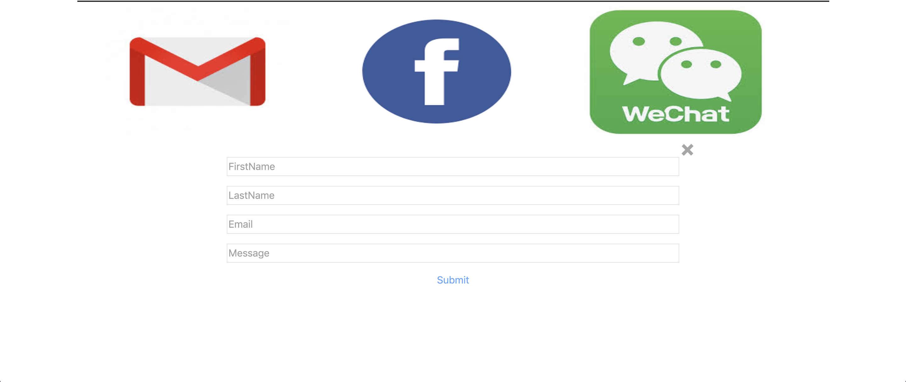

# my-homepage

## Home Page:
* personal info
* skills
* hobbies
* contact
* message

## Tech used:
* HTML
* Bootstrap
* Javascript

## How to install and use:
```
$ git clone https://github.com/zshang01/my-homepage.git
$ cd my-homepage
$ open index.html

```

## Link
[web-page](https://my-web-page-project.herokuapp.com/index.html)

## Screenshots:





## License
Licensed under the [MIT License](LICENSE).
